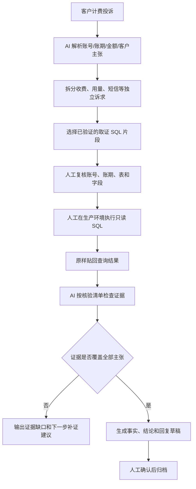

# BE 真实闭环与安全边界

## 业务闭环



## AI 做什么

1. 将自然语言投诉转换为结构化案件。
2. 把一句多诉求投诉拆成多个独立主张。
3. 从已验证知识库中选择合适的取证片段。
4. 解释每条查询要验证什么。
5. 对人工贴回的结果进行四层核验：
   - 对象和账期是否一致；
   - SQL、列名和金额是否对应；
   - 结果是否覆盖客户的每个主张；
   - 最终结论是否超过证据边界。
6. 证据不足时拒绝直接下绝对结论，并说明需要补查什么。

## 人工为什么必须执行 SQL

运营商生产数据库包含客户账务和服务数据。BE 的安全边界是：

- AI 不持有生产数据库账号；
- AI 不直接连接生产 Oracle 或其他生产库；
- AI 不能自行执行 SQL；
- SQL 只能从已验证片段中组装；
- 人工在既有堡垒机和生产操作规程下复核后执行；
- 结果原样贴回，避免 AI 修改原始证据；
- 归档前仍需人工确认。

因此，人工 SQL 不是系统能力不足，而是把高风险的数据访问权留在有权限、有责任的人手中。AI 的优势放在理解、规划和核验上。

## “查得准”的可解释依据

BE 不以模型的一句自然语言回答作为准确性证明，而要求结论绑定证据：

```text
客户主张 → 需要的证据 → 实际查询结果 → 核验状态 → 可下的结论
```

例如客户同时说“多收了 80 元，而且没有收到短信”：查询结果只有 80 元收费记录时，收费主张可以被支持，短信主张没有证据，案件整体不能直接归档。

## 可量化的安全指标（提交前补齐）

- AI 直连生产库次数：`0`；
- AI 自动执行生产 SQL 次数：`0`；
- 关键查询人工复核率：`[待填]%`；
- 未完成证据核验而归档的案件：`0`；
- 证据或草稿变更后复用旧核验的案件：`0`；
- 发现证据缺口后给出补证建议的案件数：`[待填]`。
